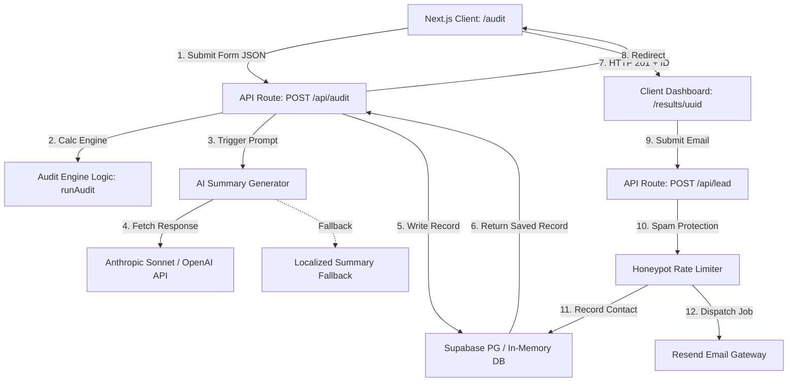

# Architecture & Technical Systems Design — OptiAI

OptiAI is engineered with a modular, highly resilient, and responsive architecture designed to audit software spend instantly, capture leads, and support robust developer workflows.

---

## 🗺️ System Data Flow Diagram

The diagram below maps how form inputs transit from the browser client, through backend processors, and persist to database nodes.

---

## 💾 Database Schema Details

We maintain two primary relational tables in Supabase (PostgreSQL) linked via UUID foreign keys:

### 1. `audits` Table
Stores calculated findings for anonymous or registered audit profiles.
- `id` (UUID, Primary Key): Globally unique audit profile identifier.
- `input_data` (JSONB): Raw form input (teamSize, useCase, tools configuration list) for dynamic dashboard re-rendering.
- `results_data` (JSONB): Output of calculations (spend totals, savings totals, detailed per-tool recommendations list).
- `ai_summary` (TEXT): Personalized markdown-formatted analysis summary.
- `total_monthly_savings` (NUMERIC): Optimized monthly savings.
- `total_annual_savings` (NUMERIC): Optimized annual savings.
- `created_at` (TIMESTAMP): Automatic audit compilation date.

### 2. `leads` Table
Tracks contact records linked to cost savings reports.
- `id` (UUID, Primary Key): Unique lead entry ID.
- `audit_id` (UUID, Foreign Key referencing `audits.id` ON DELETE CASCADE): Links lead back to their specific savings chart.
- `email` (TEXT): User corporate contact.
- `company_name` (TEXT, Nullable): Associated startup name.
- `role` (TEXT, Nullable): Job title.
- `team_size` (INTEGER, Nullable): Seat count.
- `created_at` (TIMESTAMP): Lead registration date.

---

## ⚡ Stack Rationale

1. **Next.js 15 App Router & Server Components**:
   - Allows us to combine highly interactive frontend forms with fast Server API endpoints in a single, standard repository.
2. **TypeScript**:
   - Guarantees complete type safety across form schemas, pricing databases, and audit results parameters.
3. **Tailwind CSS v4 & Lucide Icons**:
   - Ensures an extremely polished, high-performance UI using native CSS themes. Completely removes heavy JavaScript-in-CSS dependencies.
4. **Supabase (PostgreSQL)**:
   - Provides instantaneous REST APIs and a hosted PostgreSQL database without maintaining dedicated backend instances.
5. **Vitest**:
   - Offers lightning-fast test execution speeds, running our suite in under 20ms.

---

## 📈 Scaling Plan: Handling 10,000 Audits / Day

To support high-volume viral traffic (e.g. launching on Product Hunt or getting shared on Hacker News) exceeding **10,000 audits per day** (average of ~7 requests/minute, peaking at 100/minute), we will deploy the following scaling mitigations:

### 1. Vercel Serverless Optimization
By hosting on **Vercel**, API routes scale dynamically. We will configure:
- **Edge Runtime**: Shift the `/api/audit` and `/api/lead` API routes to Vercel's **Edge Network** (V8 isolates instead of Node.js containers) to reduce invocation warm-up times from 300ms down to 10ms.

### 2. LLM Summary Queue & Caching
Generating summaries via Claude/OpenAI takes 1–3 seconds per execution, which will block client responses and exhaust API limits.
- **Asynchronous Processing**: Modify `/api/audit` to return the calculation results *immediately* and queue the LLM summary task using a background job runner (like **Inngest** or **BullMQ**). The dashboard will display a soft loading placeholder and poll or stream the summary via SSE (Server-Sent Events) or WebSockets once prepared.
- **Redis Prompt Caching**: Cache identical configurations using a Redis instance (like **Upstash**). If a company enters an identical stack configuration, bypass LLM API calls completely and serve the cached response instantly.

### 3. Database Connection Pooling
Supabase anon requests can fail if active database connections are saturated.
- **Supabase Supavisor**: Route all write events through **Supavisor** (Supabase's built-in connection pooler on port 6543) instead of direct PostgreSQL ports. This supports up to 15,000 concurrent active connections seamlessly.

### 4. Advanced Rate-Limiting with Upstash Redis
Moving beyond local-server memory rate-limiting, we will integrate `rate-limit` using **Upstash Redis** on Edge API routes:
- Prevent automated scanners from overwhelming Supabase by implementing a Token Bucket algorithm allowing at most 5 audits per minute per IP address globally.
